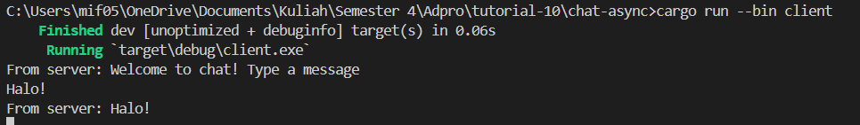
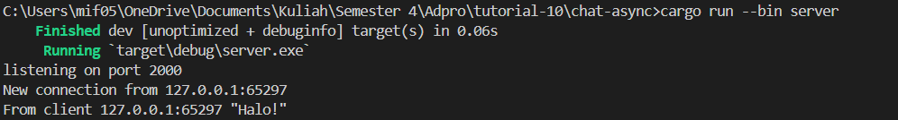

## 2.1. Original code of broadcast chat
Client:

Server:

Dari gambar di atas, tampak bahwa ketiga klien mengirimkan pesan. Selanjutnya, server menerima pesan tersebut dari setiap klien dan mengirimkan pesan tersebut kembali ke masing-masing klien. Proses ini terlihat pada gambar di atas. Pertama-tama, untuk menjalankan program yang sama, maka bukalah empat terminal. Selanjutnya, bukalah tiga terminal dan jalankan perseorangan perintah cargo run --bin client di masing-masing terminal tersebut. Terminal terakhir dibuka dan dijalankan dengan perintah cargo run --bin server. Setelah terminal terakhir dibuka dan dijalankan, klien dimungkinkan untuk mengetik pesan yang akan dikirim.
