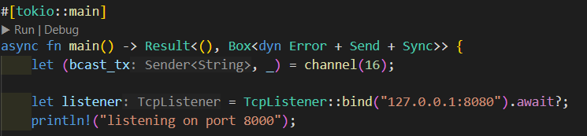
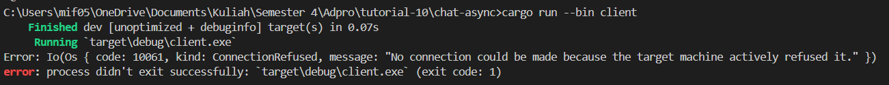
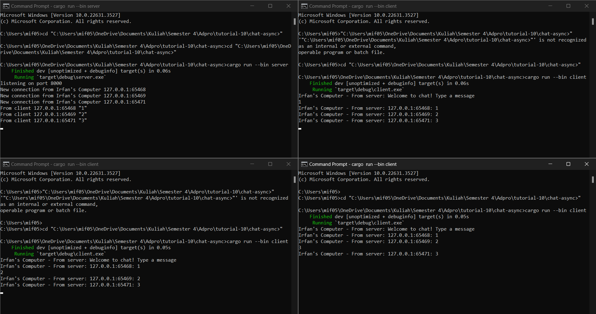

## 2.1. Original code of broadcast chat
Client:

Server:

Dari gambar di atas, tampak bahwa ketiga klien mengirimkan pesan. Selanjutnya, server menerima pesan tersebut dari setiap klien dan mengirimkan pesan tersebut kembali ke masing-masing klien. Proses ini terlihat pada gambar di atas. Pertama-tama, untuk menjalankan program yang sama, maka bukalah empat terminal. Selanjutnya, bukalah tiga terminal dan jalankan perseorangan perintah cargo run --bin client di masing-masing terminal tersebut. Terminal terakhir dibuka dan dijalankan dengan perintah cargo run --bin server. Setelah terminal terakhir dibuka dan dijalankan, klien dimungkinkan untuk mengetik pesan yang akan dikirim.

## 2.2 Modifying thw WebSocket Port
Di Server:

Di CLient:

Jika Port Berbeda:

Terlihat dari gambar di atas, jika port dari server dan client berbeda maka akan ada error.

## 2.3. Small changes. Add some information to client

Saya memastikan bahwa setiap kali server mengirim pesan melalui siaran, setiap klien dapat mengidentifikasi pengirimnya. Tujuannya adalah agar pengguna dapat mengetahui siapa yang mengirim pesan yang mereka baca. Selain itu, saya juga menyertakan informasi tentang alamat IP dan port pada setiap klien agar mereka dapat mengenali identitas mereka sendiri.